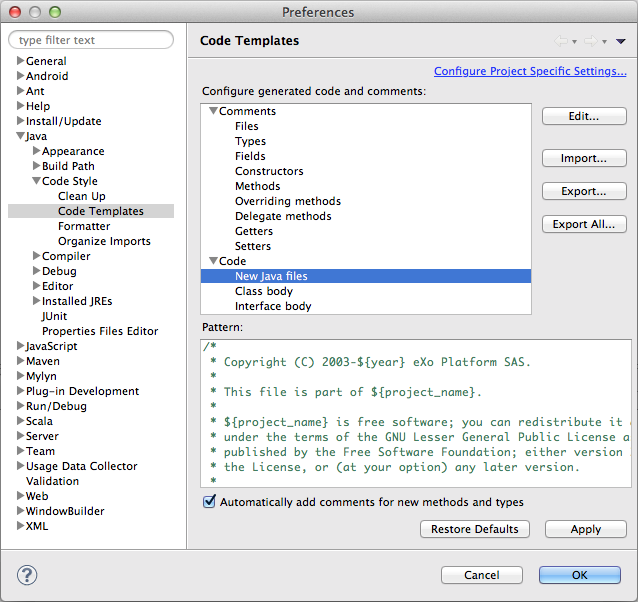
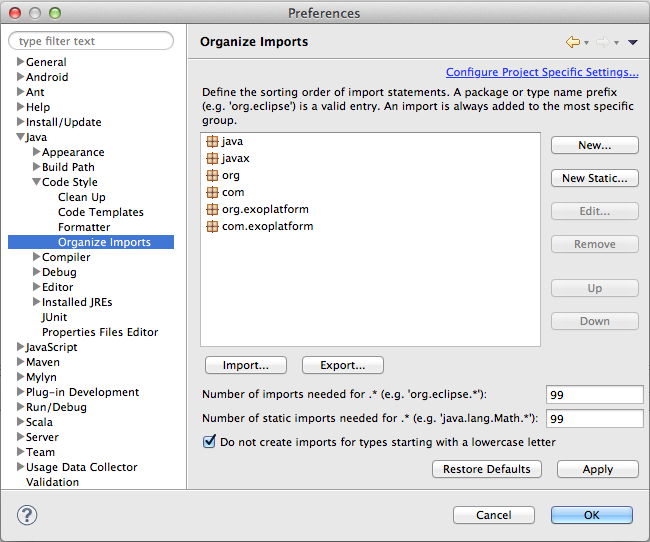



Eclipse settings are available in the directory [/resources/ide/eclipse](https://github.com/exoplatform/developer.exoplatform.org/tree/master/resources/ide/eclipse/).

Configure Eclipse at "Window" -> "Preferences..."

# Clean Up Settings:

Java -> Code Style -> Clean Up

Choose: "Import..." [/resources/ide/eclipse/exo-Java-CodeStyle-CleanUp.xml](/resources/ide/eclipse/exo-Java-CodeStyle-CleanUp.xml)

# Code Templates Settings:

Java -> Code Style -> Code Templates

Choose: "Import..." [/resources/ide/eclipse/exo-Java-CodeStyle-CodeTemplates.xml](/resources/ide/eclipse/exo-Java-CodeStyle-CodeTemplates.xml)

# Formatter Settings:

Java -> Code Style -> Formatter

Choose: "Import..." [/resources/ide/eclipse/exo-Java-CodeStyle-Formatter.xml](/resources/ide/eclipse/exo-Java-CodeStyle-Formatter.xml)

# Organize Imports Settings:

Java -> Code Style -> Organize Imports

Choose: "Import..." [/resources/ide/eclipse/exo-Java-CodeStyle-OrganizeImports.importorder](/resources/ide/eclipse/exo-Java-CodeStyle-OrganizeImports.importorder)

