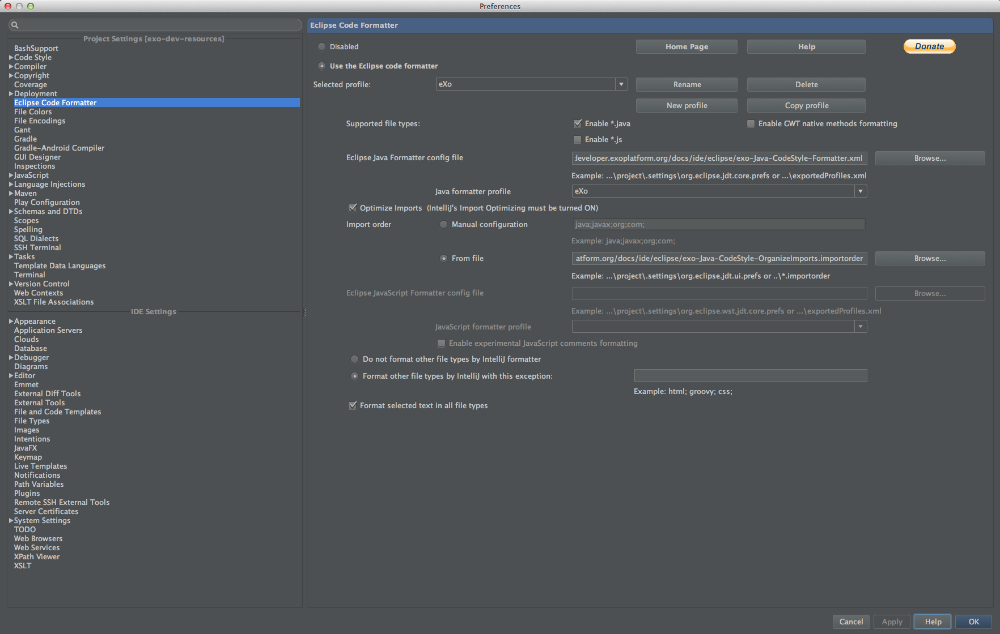



Intellij IDEA users must install the plugin [Eclipse Code Formatter](http://plugins.jetbrains.com/plugin/?id=6546) and import Eclipse settings files from the directory [/docs/ide/eclipse](https://github.com/exoplatform/developer.exoplatform.org/tree/master/docs/ide/eclipse/).

